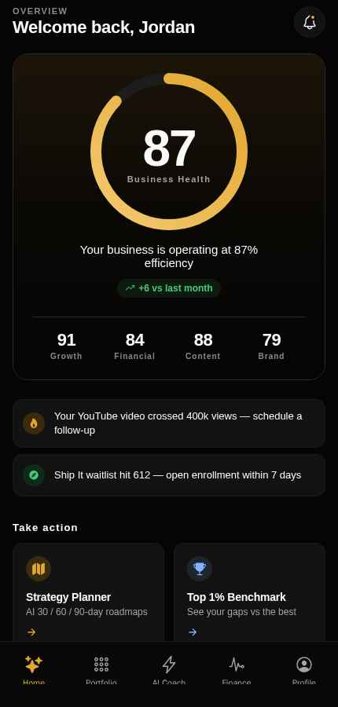

# CreatorOS

An AI business operating system for solo creators.

A creator running a YouTube channel, a paid course, and a newsletter is
running a three-product business with no CFO, no analyst, and no
strategist. CreatorOS gives them a portfolio view of their revenue
assets, a finance layer, an AI coach that knows their actual numbers,
and a generated 30/60/90 day plan.

**[Live demo](https://business-ai-hub-47.preview.emergentagent.com)** — note: this is a temporary preview environment, not a permanent production URL yet.



## Why I built this

I wanted to see what it actually takes to ship a monetised, AI-native
product end to end — not a toy chatbot demo, but something with real
auth, real billing plumbing, quotas, and an AI feature that's grounded in
a user's actual data instead of a canned response. Creators juggling
multiple revenue streams with no back-office tooling felt like a real,
narrow-enough problem to prove that out on.

## What it does

| Feature | What it solves |
|---|---|
| **Portfolio** | Every revenue asset in one view with revenue, profit, margin, audience |
| **Finance** | 30-day revenue/expense series, 90-day projection, expense breakdown |
| **AI Coach** | Streaming Claude chat with the user's real portfolio in the system prompt |
| **Strategy Planner** | 30/60/90 roadmap as structured JSON: north star, KPIs, phases, risks |
| **Goals** | Revenue, follower, subscriber and launch goals against targets |
| **Competitor Benchmark** | Nine-dimension radar against top-1% and top-10% archetypes |
| **Integrations** | YouTube, Instagram, Stripe, PayPal. Real APIs when keys are set, mocks when not |
| **Billing** | Three tiers with quota enforcement, Stripe and PayPal checkout |

## Product decisions worth explaining

**Seeded demo portfolio on first run.** New users land on a populated
dashboard rather than an empty state, because a data-dependent product
with no data cannot demonstrate its own value. All seeded records are
labelled and dismissible. Onboarding then collects real handles and the
integrations layer swaps live data in.

**Free tier gated by usage, not features.** Free users get the full
dashboard, portfolio and finance layer, limited to 10 AI Coach messages
a day and 1 strategy plan a week. Gating the expensive inference calls
rather than the core product means the free tier still demonstrates
value, and the paywall is hit by engaged users rather than new ones.

**Event allowlist for analytics.** Product events are validated against
a fixed allowlist grouped by lifecycle stage, to prevent cardinality
explosion from ad-hoc client instrumentation. Props capped at 32 keys
and 2KB, PII-named fields dropped server-side, `user_id` and `tier`
stamped by the server rather than trusted from the client. The paywall
funnel is instrumented end to end: quota_hit, upgrade_cta_shown,
upgrade_cta_tapped, checkout_started, checkout_completed.

**Mock-when-unconfigured integrations.** Every integration returns real
API data when credentials are present, deterministic mock data derived
from the handle when not. Mock payloads carry `"mocked": true`. This
keeps the full journey testable without needing five API accounts.

## Architecture

```
Expo (React Native: iOS / Android / Web)
  |__ expo-router | SecureStore (native) / localStorage (web)
        |  Bearer token
        v
FastAPI
  |__ auth.py          sessions, bearer resolution, TTL cleanup
  |__ server.py        dashboard, portfolio, finance, goals, coach (SSE)
  |__ strategy.py      30/60/90 plans, schema-constrained, per-user grounded
  |__ integrations.py  YouTube | Instagram | Stripe | PayPal
  |__ billing.py       tiers, checkout, PayPal orders
  |__ quotas.py        tier quotas + burst limits
  |__ analytics.py     event ingestion, allowlist, PII scrub
  |__ competitors.py   nine-dimension benchmarking
        |
        v
MongoDB (per-user scoped) | Claude Sonnet 4.5
```

## Running locally

```bash
# Backend
cd backend
pip install -r requirements.txt
cp .env.example .env      # MONGO_URL, DB_NAME, EMERGENT_LLM_KEY
uvicorn server:app --reload

# Frontend
cd frontend
npm install
npx expo start
```

Optional keys unlock live integrations: `YOUTUBE_API_KEY`,
`STRIPE_API_KEY`, `PAYPAL_CLIENT_ID`, `INSTAGRAM_LONG_LIVED_TOKEN`.
Without them the app runs fully on deterministic mock data.

Set `DEMO_MODE=true` locally to exercise the paid tier without a card.
It should be flipped to `false` before production so it cannot
accidentally ship with mock upgrades enabled.

## Testing

107 tests across auth, quotas, billing, PayPal orders, goals and SSE
streaming.

```bash
cd backend && pytest tests/ -v
```

On top of that, `backend/evals/` is a small, separate eval suite that
checks the *quality* of AI-generated output — not just that it's valid
JSON, but that it's actually grounded in the signed-in user's real
portfolio and scaled sensibly to their revenue. It makes real Claude
calls, so it's run on demand rather than on every commit:

```bash
cd backend && pytest evals/ -v -s
```

Build and test history for all 18 iterations is in `docs/build-log/`,
including the security pass at iteration 13.

## Known limitations

- Burst rate limiter is in-process, so per-worker. Holds for
  single-worker deployments, needs Redis to scale horizontally.
- Instagram Graph API needs a Business account and app review;
  mock-only unless a long-lived token is supplied.
- Competitor benchmarks are curated archetypes, not real handles,
  deliberately, to avoid scraping real creators' data.
- Finance projections are a linear model with growth, not a forecast.
  Labelled as such in the UI.
- Stripe's real checkout/payment flow is not yet built — the read side
  (balance/charges) supports a real key, but taking an actual card
  payment via Stripe is still simulated. PayPal's real Orders v2 flow,
  by contrast, is fully implemented and just needs credentials.

## How this was built

I built CreatorOS using Emergent, an AI app builder, across 18
iterations. That was deliberate: my constraint was time, not coding
ability, and directing the build let me spend my hours on decisions
rather than typing.

The product framing, tier and pricing model, analytics event schema,
empty-state strategy, and the security review at iteration 13 are mine.
The commit history reflects the tooling.

The most useful thing I learned came from a bug the tooling could not
have caught. My AI Coach personalises correctly, reading the user's
assets from the database into its system prompt. My Strategy Engine had
the demo persona hardcoded, so every user received a plan built for
someone else's business. It passed every functional test, because the
tests validated that schema-conformant JSON came back. The output was
fluent, structured, and wrong. That pushed me to build the eval suite in
`backend/evals/`, which checks groundedness and scale-appropriateness
rather than just whether the response parses.
